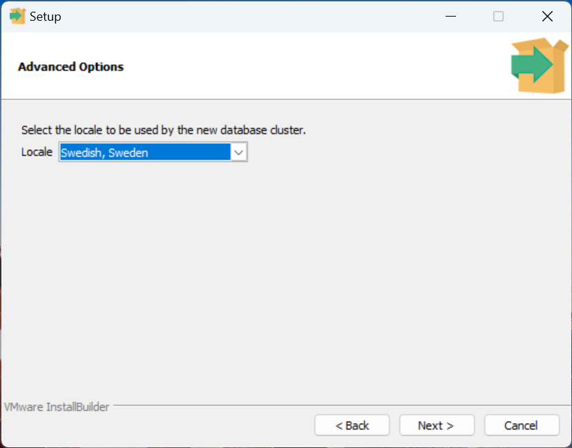
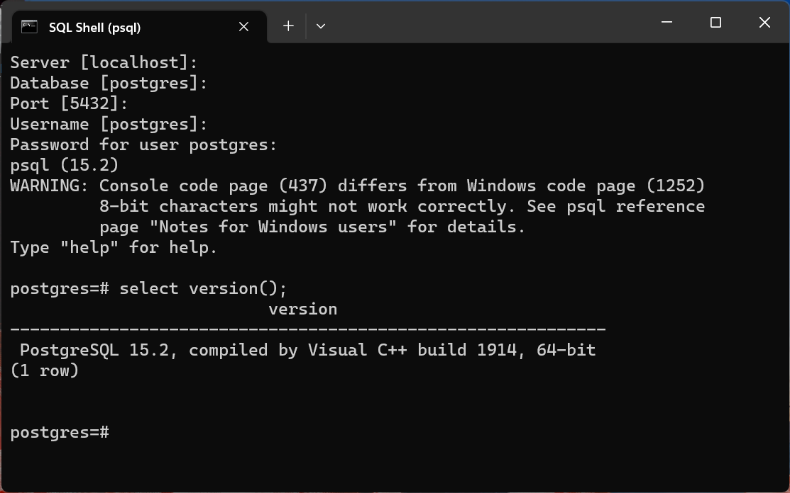
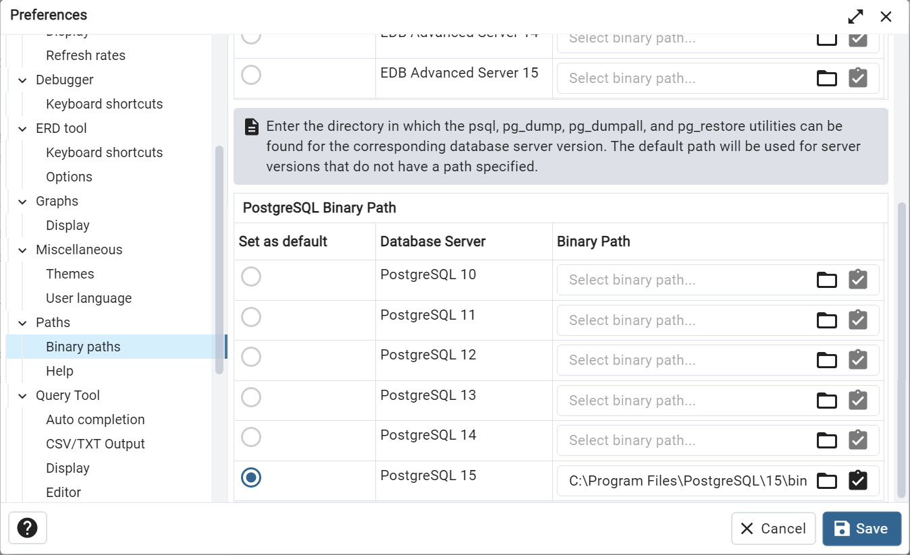

# Download

If you use windows, go to this page 

https://www.enterprisedb.com/downloads/postgres-postgresql-downloads

...and click on **Windows x86-64** version 15.2 (300Mb)

For other operating systems follow this link: https://www.postgresql.org/download/

# Install

Run the installation. Don't make any choices during installation, expect when chosing **locale**, then choose **Swedish, Sweden**

For superuser password just enter the word **password**

Installation takes 5-10 minutes.

Don't install **Stack Builder**

# Verify

Press windows key and write **psql** to open SQL Shell

Press enter four times. When this is displayed: **Password for user postgres:** then enter your password (probably **password**)

Write this command:

    select version();

...and you should get the version number

If your screen is similar the image below, you've successfully installed Postgres.

Now you can just close this window

# pgAdmin 4

Press the window key and enter **pgAdmin 4** and run the program

You need to enter your password (probably just **password**)

Select File->Preferences. Scroll down to **Paths**. Write

    C:\Program Files\PostgreSQL\15\bin

...as path to PostgreSQL 15, as seen here:

Right-click the **postgres** database. **Query Tool**

Write this

    SELECT version();

and execute (press F5). You should get a result like this:

    PostgreSQL 15.2, compiled by Visual C++ build 1914, 64-bit
