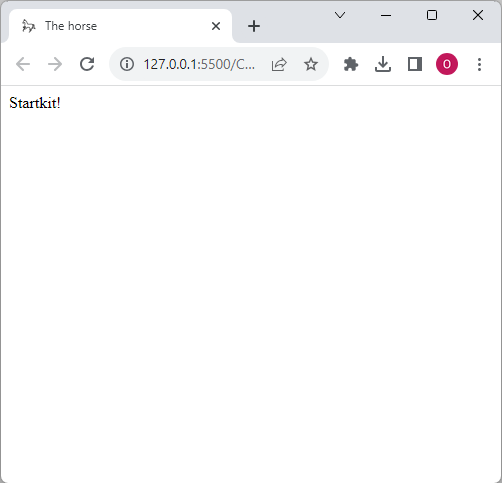
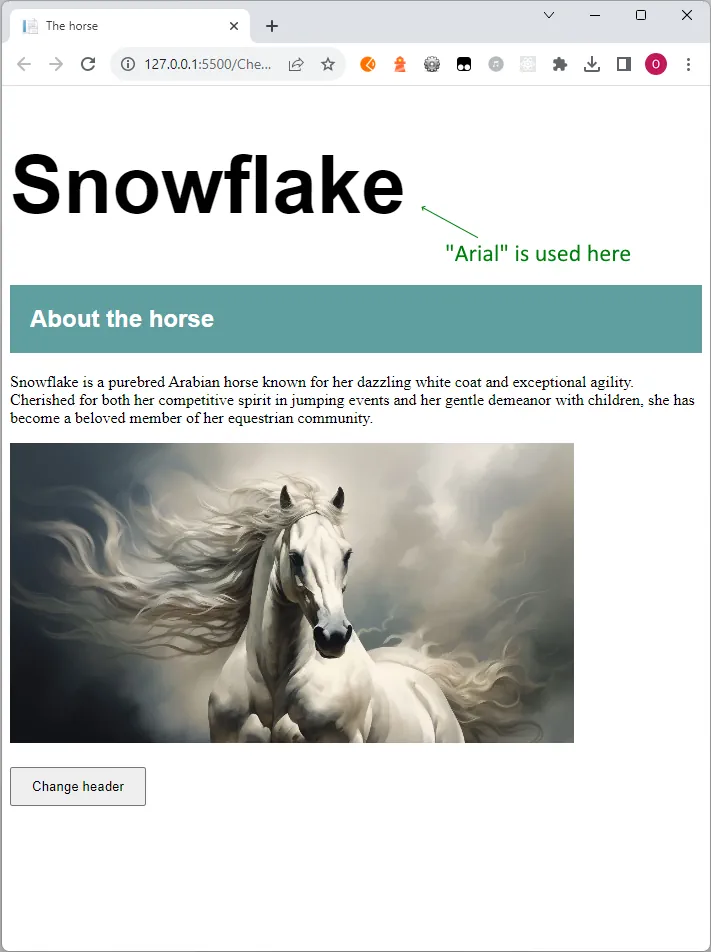
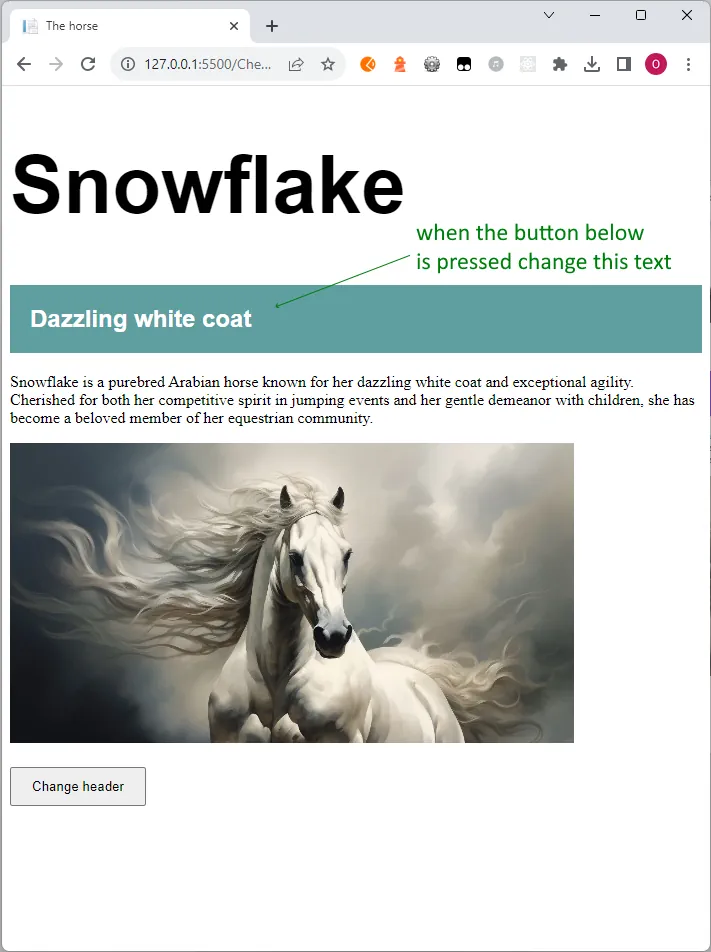
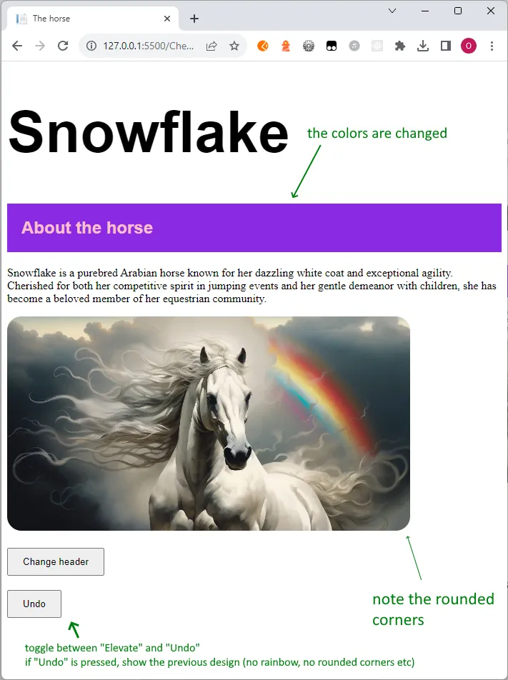

# Getting started

Copy the files in the **Startkit**-folder to your **My**-folder. Open the HTML-file. It should look like this:

# Level 1

Create the following webpage: (note the colors, margins etc)

If the user clicks the button change the header to *Dazzling white coat* :

# Level 2

First solve Level 1.

Add a button **Elevate**:

When this button is pressed, **toggle** between showing the original design and this design. The button should toggle between the texts **Elevate** and **Undo**

