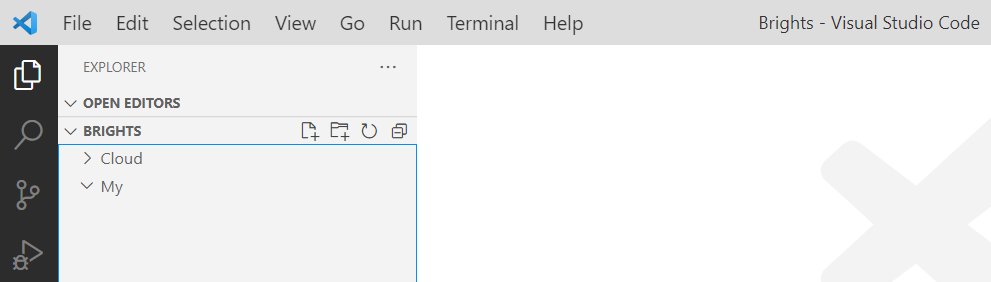

# Intro

Here is a guide how to setup GIT. 

When everything is setup you'll have a wonderful experience working with new and updated course materials 😊

# Install GIT

Click on this link

https://git-scm.com/download/win

Choose **64-bit Git for Windows Setup**, which will download the file. Run the file and then just press next, next, next (don't make any choices, just keep default)

# Setup

Start the Command Prompt:

- Press the **windows key** and write **cmd**
- Press enter

Now the command prompt should open

Write the following commands. It will create two folders: Cloud and My + connect the Cloud folder to a central folder (repository). 

    cd c:\

    mkdir Brights

    cd Brights

    mkdir My

    git clone https://github.com/happy-bits/trafikverket Cloud

# View all files in VS Code

To view your files and the teachers files open the folder C:\Brights in Visual Studio code

You should now see two folders Cloud and My:

During the course, do all work on the **My** folder

Don't modify anything in the **Cloud** folder

# Get the latest files

When you want to get the latest files from the teacher do:

    cd c:\Brights\Cloud
    git pull

If it says

    Already up to date

...then you already have the most recent files

# Error

If you get an error after **git pull** that looks something like this:

    error: Your local changes to the following files would be overwritten by merge:
            Frontend/readme.md
    Please commit your changes or stash them before you merge.
    Aborting
    Updating a8f44cd..2f8b65c

...then you have by accident changed a file in the **Cloud** folder.

Discard your all your changes in the Cloud folder:

After that you can run

    git pull